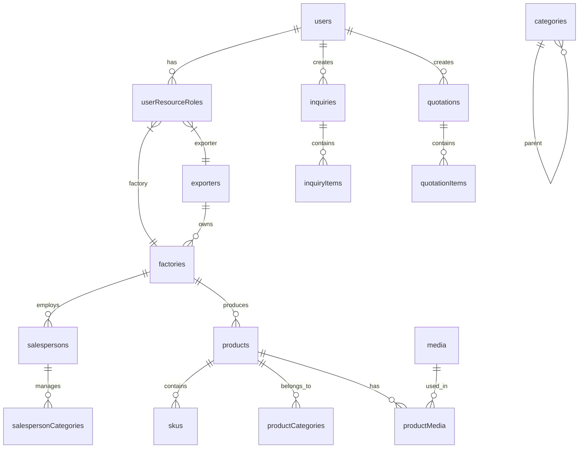

# 数据库设计总结文档

## 一、核心设计原则

### 1. 命名规范
- **表名**：统一使用小驼峰命名（camelCase）
  - ✅ `usersTable`, `productsTable`, `categoriesTable`
  - ❌ `products_table`, `product_images`

- **字段名**：使用下划线分隔的 snake_case
  - ✅ `created_at`, `updated_at`, `user_id`
  - ❌ `createdAt`, `updatedAt`, `userId`

### 2. 主键设计
- 所有表统一使用 `uuid` 作为主键
- 通过 `idUuid` helper 统一生成主键定义

### 3. 审计字段
- 每个表都包含标准审计字段：
  - `id`: UUID主键
  - `createdAt`: 创建时间（带时区）
  - `updatedAt`: 更新时间（带时区）

## 二、模块架构

### 1. 认证与权限模块 (Auth)
位置：`packages/contract/src/modules/01auth/`

#### 核心表：
- `usersTable` - 用户基础信息
- `accountTable` - 第三方账户关联
- `sessionTable` - 用户会话管理
- `verificationTable` - 验证码管理
- `userprofileTable` - 用户扩展信息

#### 权限系统（已优化）：
- **统一使用资源角色模型**：`userResourceRolesTable`
- **移除重复表**：
  - ❌ `userRoleTable`（基础角色）
  - ❌ `userExportersTable`（出口商角色）
  - ❌ `userFactoriesTable`（工厂角色）
  - ✅ `userResourceRolesTable`（统一资源角色）

#### 权限类型：
```typescript
// 资源类型
factory     // 工厂权限
exporter    // 出口商权限
product     // 商品权限
order       // 订单权限

// 角色级别
exporter_admin    // 出口商管理员
factory_admin     // 工厂管理员
salesperson       // 业务员
```

### 2. 出口商模块 (Exporter)
位置：`packages/contract/src/modules/01exporter/`

#### 核心表：
- `exportersTable` - 出口商主表

#### 字段修复：
- ✅ `bankInfo` (原 `blankInfo`) - 银行信息JSON
- ✅ 拼写错误已修正：`beneficiary` (原 `beneficiart`)

### 3. 工厂模块 (Factory)
位置：`packages/contract/src/modules/01factory/`

#### 核心表：
- `factoriesTable` - 工厂主表
- `salespersonsTable` - 业务员表
- `salespersonCategoriesTable` - 业务员分类关联

#### 字段修复：
- ✅ `contactPhone` 类型从 `integer` 改为 `varchar(50)`

#### 关系：
- 工厂归属于出口商（`exporterId`）
- 业务员归属于工厂（`factoryId`）

### 4. 产品模块 (Product)
位置：`packages/contract/src/modules/product/`

#### 核心表：
- `productsTable` - 产品SPU表
- `skusTable` - SKU表
- `productCategoriesTable` - 产品分类关联
- `productMediaTable` - 产品媒体关联（需要重命名）
- `attributeTemplateTable` - 属性模板
- `attributeTable` - 属性定义
- `attributeValueTable` - 属性值

#### 特点：
- 支持SPU-SKU模式
- 灵活的属性模板系统
- 完整的媒体关联管理

### 5. 分类模块 (Category)
位置：`packages/contract/src/modules/category/`

#### 核心表：
- `categoriesTable` - 支持无限层级树形结构

### 6. 媒体模块 (Media)
位置：`packages/contract/src/modules/media/`

#### 核心表：
- `mediaTable` - 媒体文件主表
- `mediaMetadataTable` - 媒体元数据表

#### 特点：
- 统一的媒体管理
- 支持多种存储策略（本地/OSS）
- 元数据分离设计

### 7. 询盘模块 (Inquiry)
位置：`packages/contract/src/modules/inquiry/`

#### 核心表：
- `inquiryTable` - 询盘主表
- `inquiryItemTable` - 询盘明细

### 8. 报价模块 (Quotation)
位置：`packages/contract/src/modules/quotation/`

#### 核心表：
- `quotationTable` - 报价单主表
- `quotationItemTable` - 报价明细

## 三、数据关系图



## 四、优化建议

### 1. 索引优化
```sql
-- 用户表索引
CREATE INDEX idx_users_email ON users(email);
CREATE INDEX idx_users_active ON users(is_active);

-- 工厂表索引
CREATE INDEX idx_factories_code ON factories(code);
CREATE INDEX idx_factories_exporter ON factories(exporter_id);

-- 产品表索引
CREATE INDEX idx_products_factory ON products(factory_id);
CREATE INDEX idx_products_category ON products(category_id);
CREATE INDEX idx_products_status ON products(status);

-- SKU表索引
CREATE INDEX idx_skus_product ON skus(product_id);
CREATE INDEX idx_skus_code ON skus(sku_code);
```

### 2. 复合索引
```sql
-- 产品分类关联
CREATE UNIQUE INDEX idx_product_category_unique ON product_categories(product_id, category_id);

-- 用户资源角色
CREATE UNIQUE INDEX idx_user_resource_unique ON user_resource_roles(user_id, resource_type, resource_id);
```

### 3. 数据完整性
- 添加外键约束的 `ON DELETE` 策略
- 重要字段添加 `NOT NULL` 约束
- 价格字段使用 `decimal` 类型，添加 `CHECK (price >= 0)`

### 4. 性能优化
- 大表考虑分区策略（按时间分区）
- 历史数据归档机制
- 读写分离架构

## 五、安全设计

### 1. 敏感数据加密
- 用户手机号：加密存储
- 银行信息：必须加密
- 身份证信息：加密存储

### 2. 审计日志
- 关键操作记录操作日志
- 数据变更历史追踪
- 登录日志完整记录

### 3. 软删除
- 重要数据使用软删除
- 添加 `deleted_at` 字段
- 查询时自动过滤已删除数据

## 六、开发规范

### 1. Schema 定义规范
```typescript
// ✅ 正确示例
export const exampleTable = pgTable("examples", {
  id: idUuid,
  createdAt,
  updatedAt,

  // 业务字段
  name: varchar("name", { length: 200 }).notNull(),
  description: text("description"),
  isActive: boolean("is_active").default(true).notNull(),
});
```

### 2. 关系定义规范
```typescript
// ✅ 正确示例
export const exampleRelations = relations(exampleTable, ({ one, many }) => ({
  user: one(usersTable, {
    fields: [exampleTable.userId],
    references: [usersTable.id],
  }),
  items: many(exampleItemsTable),
}));
```

### 3. 类型导出规范
- Schema 定义使用 `.schema.ts` 后缀
- 类型定义使用 `.t.model.ts` 后缀
- 在 `index.ts` 中统一导出

## 七、版本控制

- 所有 schema 变更需要通过 Drizzle 迁移管理
- 迁移文件命名：`{timestamp}_{description}.sql`
- 生产环境迁移需要回滚方案

## 八、注意事项

1. **权限系统**：使用统一的 `userResourceRolesTable` 管理所有资源权限
2. **命名规范**：严格遵循 camelCase 表名，snake_case 字段名
3. **数据类型**：
   - 电话号码使用 `varchar`
   - 金额使用 `decimal`
   - 时间戳使用带时区的 `timestamp`
4. **关系维护**：确保外键引用正确，级联策略合理
5. **索引设计**：根据查询模式设计合适的索引

---

*最后更新时间：2025-12-12*
*版本：v1.0*